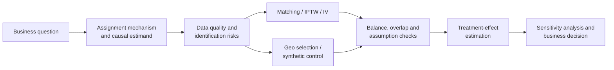

<div align="center">

# Causal Impact Case Studies

**Two applied studies in observational adjustment, instrumental variables, and geo-experiment design.**

[](https://www.python.org/)
[](https://www.r-project.org/)
[](https://www.statsmodels.org/)
[](https://jupyter.org/)

</div>

## Overview

This repository applies causal-inference methods to two fictional business cases where a simple outcome comparison would be misleading:

1. **Career 2030 training:** recover an estimate of a professional-development program's effect on promotion after non-compliance and selection compromised the original randomized design.
2. **Geo marketing holdout:** design and analyze a four-week geographic experiment for a national Google Performance Max campaign using a synthetic-control workflow.

Together, the cases demonstrate covariate balance diagnostics, matching, inverse-probability weighting, instrumental-variable reasoning, treatment-market selection, regularized donor selection, and counterfactual estimation.

## Findings at a glance

| Case | Design and methods | Recorded result | Interpretation |
| --- | --- | --- | --- |
| Employee training | 6,000 employees; 1:1 matching, propensity-score matching, IPTW, IV | IV second-stage coefficient: **about 0.232**; reported `p < 2.2e-16` | Positive exploratory effect, conditional on a debatable exclusion restriction |
| Geo marketing | Two years of weekly state orders; Lasso-selected synthetic control | Holdout effect: about **-1.45k orders/week**; paired-test `p = 0.00236` | Withholding the campaign was associated with lower orders in the selected markets |
| National scenario | OLS extrapolation from treatment geos | Modeled four-week loss of about **$155k** without the campaign | Scenario estimate depends on linear extrapolation and cost assumptions |

> [!IMPORTANT]
> These are academic case studies, not production experiments. The employee-training instrument (`disthome`) is statistically related to the outcome in a marginal correlation test (`p = 0.00145`), so the exclusion restriction is not secure. The IV second stage is also fitted with `lm`; exponentiating its coefficient does not turn it into an odds ratio, despite the original report's 1.26x interpretation. The geo notebook records an average effect of `-1454.9` per week, while the report states `-1349.7`; the discrepancy should be resolved before external use.

## Analytical workflow



## Case study 1: Career 2030 training

### Problem

The original experiment assigned a small employee cohort to training and control groups, but realized participation no longer resembled clean random assignment. Manager intervention, employee self-selection, attrition, and non-compliance created imbalance between 2,291 trained and 3,709 untrained employees.

The outcome is promotion within one year. Candidate confounders include role and compensation variables, demographic attributes, benefits participation, test scores, and distance from the training facility.

### Methods

- **Balance assessment:** propensity-score overlap and standardized mean differences (SMDs).
- **One-to-one matching:** caliper sensitivity and paired-outcome testing.
- **Propensity-score matching:** logistic treatment model, 1:1 matching, overlap checks, and McNemar testing.
- **IPTW:** inverse-probability weights to create a pseudo-population balanced on measured covariates.
- **Instrumental-variable analysis:** distance from home as the proposed instrument, followed by first- and second-stage regressions.

### Recorded estimates

| Method | Reported effect measure | Reported significance | Key concern |
| --- | ---: | ---: | --- |
| 1:1 matching | 1.63 | `< 0.001` | Residual imbalance in distance and test score |
| Propensity-score matching | 2.43 | `< 0.001` | Sensitivity to propensity specification and overlap |
| IPTW | 1.36 | `< 0.001` | Extreme-weight and model-specification risk |
| Instrumental variable | 0.232 second-stage coefficient; report converts this to 1.26 | `< 2.2e-16` | Exclusion is uncertain, and exponentiating a linear-model coefficient is not an odds ratio |

The estimates agree on direction, but their magnitudes differ. That is useful sensitivity evidence, not proof that every identification strategy is valid.

## Case study 2: Geo marketing holdout

### Experiment design

The analysis selects **Tennessee, Missouri, Montana, and New Mexico** as treatment markets. Delaware is excluded because cross-border exposure could violate consistency, while the final four-state set balances model fit, statistical relevance, national-sales representation, and operational cost.

### Synthetic control

1. Aggregate treatment-market orders for the pre-period.
2. Exclude treatment markets and other unavailable states from the donor pool.
3. Use cross-validated Lasso to select **Florida, North Carolina, Ohio, Oregon, Pennsylvania, and Texas**.
4. Fit a linear model on pre-treatment data.
5. Predict the counterfactual treatment-market trajectory during the four-week holdout.
6. Compare observed and predicted orders, then map the local effect to a national scenario.

The stored notebook reports a total four-week treatment-market effect of `-5819.6`, or `-1454.9` per week, with a paired-test p-value of `0.00236`. Because treatment is campaign withholding, a negative estimate is consistent with the campaign supporting demand.

## Repository guide

| Path | Purpose |
| --- | --- |
| `Cleaning and Matching.ipynb` | R-based balance diagnostics, matching, IPTW, and IV analysis for employee training |
| `Find treatment-Delaware free .ipynb` | Candidate treatment-market search and geo-selection diagnostics |
| `Calculate effect.ipynb` | Python synthetic control, treatment-effect calculation, and national extrapolation |
| `CI Reports/Cleaning and Matching.pdf` | Full Career 2030 analysis and recommendations |
| `CI Reports/Effect.pdf` | Geo-holdout design, synthetic-control analysis, and campaign scenario |

> [!NOTE]
> Filenames preserve the original submission and commit history. A future refactor can move the notebooks into case-specific directories after adding automated reproduction checks.

## Running the notebooks

The raw CSV files are not included. Expected inputs referenced by the notebooks are:

- `TrainingPromoData.csv`
- `ACMEOrdersData.csv`
- `orders_treatment_period.csv`

For the Python notebooks:

```bash
python -m venv .venv
source .venv/bin/activate  # Windows: .venv\Scripts\activate
pip install -r requirements.txt
jupyter lab
```

For the R notebook, install the packages listed in `R-packages.txt` and use an R-enabled Jupyter kernel.

## Limitations and next steps

- The source data is unavailable, so the recorded outputs cannot be reproduced from this repository alone.
- Statistical significance does not validate matching quality or causal assumptions.
- The proposed IV has evidence against a strict exclusion restriction and needs stronger domain justification or a different instrument.
- The geo paired t-test uses only four treatment weeks; placebo periods, permutation inference, and pre-period RMSPE comparisons would be more credible.
- The synthetic-control implementation uses Lasso for donor selection followed by unconstrained linear regression rather than canonical non-negative, sum-to-one weights.
- National extrapolation assumes a stable linear relationship between the four treatment geos and total orders.
- A production version should define estimands up front, separate design from outcome analysis, add placebo and falsification tests, and track all scenario assumptions explicitly.

## Project context and attribution

These projects were completed as academic team case studies. The Career 2030 report lists Lanston Chen, Wenxi Xu, Icy Wang, Yihua Wang, and Yizhou Sun as contributors. The repository preserves the original reports and notebooks while adding a more transparent portfolio-level interpretation.
